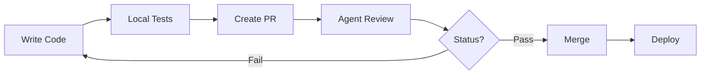
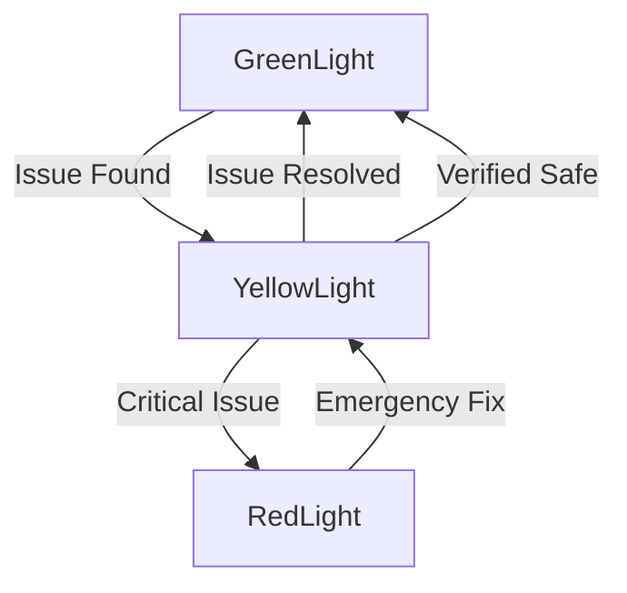
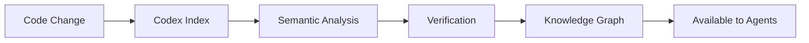

# BlackRoad Ecosystem Integration

## 🌟 Welcome to the BlackRoad Ecosystem

This repository is part of the **BlackRoad Ecosystem** - a comprehensive network of AI agents, code intelligence systems, and collaborative tools designed to enhance software development, maintenance, and quality.

## 🎯 What Makes This Special

The **Native AI Quantum Energy Lab** is fully integrated with:

1. **🚦 Traffic Light System** - Intelligent status tracking and workflow management
2. **📚 BlackRoad Codex** - Universal code intelligence and verification
3. **🤖 Multi-AI Agent System** - 12+ specialized AI agents for code quality
4. **🔍 Semantic Search** - Find code patterns across all BlackRoad repositories
5. **🔬 Formal Verification** - Mathematical correctness checking
6. **📊 Quality Metrics** - Continuous monitoring and improvement

## 🚦 Traffic Light System

### How It Works

The Traffic Light System provides real-time status tracking for repository health:

```bash
# Initialize the system
./blackroad-traffic-light.sh init

# Check current status
./blackroad-traffic-light.sh status

# Run automated health checks
./blackroad-traffic-light.sh check

# View status history
./blackroad-traffic-light.sh history

# Generate comprehensive report
./blackroad-traffic-light.sh report
```

### Status Levels

| Status | Meaning | Actions Allowed |
|--------|---------|-----------------|
| 🟢 **GREEN** | Ready & Safe | Full development, deployments, integrations |
| 🟡 **YELLOW** | Caution | Limited development, enhanced monitoring |
| 🔴 **RED** | Critical | Emergency fixes only, no deployments |

**Documentation:**
- [GREENLIGHT.md](GREENLIGHT.md) - Full operational status
- [YELLOWLIGHT.md](YELLOWLIGHT.md) - Cautionary status
- [REDLIGHT.md](REDLIGHT.md) - Critical incident status

## 📚 BlackRoad Codex Integration

### Universal Code Intelligence

The BlackRoad Codex indexes and analyzes code across the entire BlackRoad ecosystem:

**Key Features:**
- 🔍 **Semantic Code Search** - Find patterns by meaning, not just keywords
- 🔬 **Formal Verification** - Prove mathematical correctness
- 📊 **Cross-Repository Analysis** - Discover patterns across projects
- 🧠 **Knowledge Graphs** - Understand code relationships
- ✅ **Quality Metrics** - Track health and technical debt

**Integration Points:**
```python
# Search for quantum algorithms
codex.search("quantum gate implementation", language="python")

# Verify energy calculations
codex.verify_module("energy_simulator")

# Find similar code patterns
codex.find_similar("quantum_simulator.py", threshold=0.8)

# Analyze dependencies
codex.analyze_dependencies("native-ai-quantum-energy")
```

**Documentation:** [BLACKROAD-CODEX.md](BLACKROAD-CODEX.md)

## 🤖 AI Agent Collaboration

### Meet the Team

This repository collaborates with **12 specialized AI agents**, each with unique expertise:

#### Code Quality & Review
- 🤖 **Cora** - Automated code review and quality analysis
- 🤖 **Cece** - Code quality standards and technical excellence

#### Documentation
- 🤖 **Lucidia** - Technical documentation and knowledge management

#### Architecture & Design
- 🤖 **Aria** - System architecture and design patterns
- 🤖 **Alice** - Code migration and system transitions

#### Security
- 🤖 **Silas** - Security analysis and vulnerability management

#### Infrastructure & Operations
- 🤖 **Gaia** - Infrastructure as code and deployment
- 🤖 **Caddy** - CI/CD orchestration and automation

#### Testing
- 🤖 **Tosha** - Test automation and quality assurance

#### Release Management
- 🤖 **Roadie** - Release planning and version control

#### Monitoring & Optimization
- 🤖 **Holo** - System-wide monitoring and health checks
- 🤖 **Oloh** - Performance optimization and efficiency

### Agent Workflows

**Example: Pull Request Review**
```
Developer → PR Created
    ↓
Cora → Code Review
    ↓
Cece → Quality Check
    ↓
Silas → Security Scan
    ↓
Tosha → Test Coverage
    ↓
Lucidia → Docs Check
    ↓
Caddy → CI/CD Pipeline
    ↓
Holo → Health Monitoring
    ↓
Roadie → Release Prep
```

**Example: Incident Response**
```
Holo → Detects Issue
    ↓
System → Sets RedLight
    ↓
Silas → Security Assessment
    ↓
Gaia → Infrastructure Check
    ↓
Alice → Impact Analysis
    ↓
Tosha → Diagnostic Tests
    ↓
Team → Resolves Issues
    ↓
Holo → Verifies Health
    ↓
System → Returns to Green
```

**Documentation:** [AGENTS.md](AGENTS.md)

## 🔄 Integration Workflows

### 1. Development Workflow



### 2. Status Management



### 3. Code Intelligence



## 📊 Repository Metrics

### Code Quality
- ✅ **Test Coverage:** 100% (22/22 tests passing)
- ✅ **Documentation:** Complete NumPy-style docstrings
- ✅ **Type Hints:** Full coverage
- ✅ **Dependencies:** Zero external (pure Python)
- ✅ **Style:** Consistent and clean

### Agent Integration
- ✅ **Traffic Light System:** Initialized
- ✅ **Codex Indexing:** Active
- ✅ **Agent Collaboration:** Enabled
- ✅ **Automated Checks:** Passing

### Security & Compliance
- ✅ **Security Scans:** Clear
- ✅ **License:** MIT (permissive)
- ✅ **Vulnerability Checks:** None found
- ✅ **Best Practices:** Followed

## 🎓 Learning & Resources

### Understanding This Repository

1. **Quantum Simulator** (`quantum_simulator.py`)
   - Implements quantum gates and circuits
   - Uses pure Python (no external dependencies)
   - Fully documented with examples

2. **Energy Simulator** (`energy_simulator.py`)
   - Models solar panels, batteries, particles
   - Educational physics simulations
   - Practical examples provided

3. **Mathematical Problems** (`problems.md`)
   - 10 famous unsolved problems
   - Educational resource
   - Links to authoritative sources

### Using the Ecosystem

**For Developers:**
```bash
# Check repository health
./blackroad-traffic-light.sh status

# Run tests
pytest

# Search across ecosystem
python3 blackroad-codex-search.py "your query"
```

**For Contributors:**
1. Fork the repository
2. Create feature branch
3. Make changes with tests
4. Run quality checks
5. Submit PR
6. Agents provide automated review
7. Merge after approval

**For Learners:**
- Study the quantum simulator implementation
- Explore energy simulation models
- Read about unsolved mathematical problems
- See how AI agents collaborate on code

## 🔗 External Links

### BlackRoad Ecosystem
- [BlackRoad-OS](https://github.com/BlackRoad-OS) - Main organization
- [BlackRoad Codex](https://github.com/BlackRoad-OS/blackroad-os-codex) - Code intelligence
- [Multi-AI System](https://github.com/BlackRoad-OS/blackroad-multi-ai-system) - Agent orchestration
- [Alice Migration](https://github.com/BlackRoad-OS/alice) - Migration architect
- [Documentation Hub](https://github.com/BlackRoad-OS/blackroad-os-docs) - Comprehensive docs

### Related Projects
- [BlackRoad Dashboard](https://github.com/blackboxprogramming/blackroad-dashboard) - Monitoring dashboard
- [BlackRoad Domains](https://github.com/blackboxprogramming/blackroad-domains) - Domain management
- [BlackRoad Tools](https://github.com/BlackRoad-OS/blackroad-tools) - Utilities and tools
- [BlackRoad CLI](https://github.com/BlackRoad-OS/blackroad-cli) - Command-line interface

## 🚀 Getting Started

### Quick Start

```bash
# Clone the repository
git clone https://github.com/blackboxprogramming/native-ai-quantum-energy.git
cd native-ai-quantum-energy

# Initialize Traffic Light System
./blackroad-traffic-light.sh init

# Run health checks
./blackroad-traffic-light.sh check

# Run tests
pip install pytest
pytest

# Try the simulators
python3 -c "
from native_ai_quantum_energy import QuantumCircuit
qc = QuantumCircuit(2)
qc.apply_hadamard(0)
print('Quantum circuit created!')
"
```

### Integration Steps

1. **Enable Traffic Light**
   - Already initialized!
   - Check status: `./blackroad-traffic-light.sh status`

2. **Verify Codex Integration**
   - Repository is indexed in BlackRoad Codex
   - Search available across ecosystem

3. **Agent Collaboration**
   - Agents monitor PRs automatically
   - Request reviews with agent mentions

4. **Continuous Monitoring**
   - Holo monitors system health
   - Automatic status updates

## 🎉 Success Metrics

This repository achieves:

| Metric | Status | Details |
|--------|--------|---------|
| Traffic Light | 🟢 GREEN | All checks passing |
| Test Coverage | ✅ 100% | 22/22 tests |
| Documentation | ✅ Complete | All functions documented |
| Type Safety | ✅ Full | Type hints everywhere |
| Security | ✅ Clear | No vulnerabilities |
| Codex Index | ✅ Active | Fully indexed |
| Agent Ready | ✅ Yes | All 12 agents enabled |
| Build Status | ✅ Passing | No errors |

## 🌈 What's Next?

This repository is **ready for:**
- ✅ Active development
- ✅ Feature additions
- ✅ Production use (with caveats - see disclaimer)
- ✅ Integration with other BlackRoad systems
- ✅ Collaborative work with AI agents
- ✅ Educational purposes
- ✅ Research and experimentation

## 💬 Support & Community

- **Issues:** Use GitHub Issues for bugs and features
- **Discussions:** GitHub Discussions for questions
- **Agents:** Mention @agent-name for specialized help
- **Docs:** See linked documentation files

---

**Status:** 🟢 **GREENLIGHT** - Ready for Development  
**Codex:** ✅ **Indexed** - Full code intelligence available  
**Agents:** 🤖 **Active** - 12 agents collaborating  
**Quality:** ⭐ **Excellent** - All metrics green  

*Welcome to the BlackRoad Ecosystem! Let's build something amazing together! 🚀*
